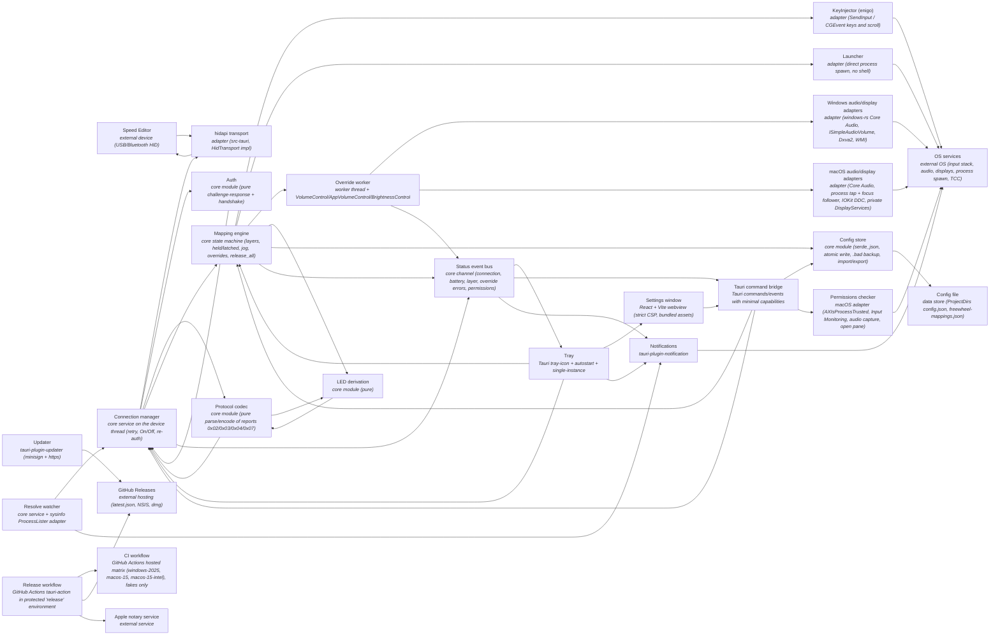

# freewheel architecture

```mermaid
%% freewheel components (mermaid)
flowchart LR
    Speed_Editor["Speed Editor<br/><i>external device (USB/Bluetooth HID)</i>"]
    hidapi_transport["hidapi transport<br/><i>adapter (src-tauri, HidTransport impl)</i>"]
    Connection_manager["Connection manager<br/><i>core service on the device thread (retry, On/Off, re-auth)</i>"]
    Auth["Auth<br/><i>core module (pure challenge-response + handshake)</i>"]
    Protocol_codec["Protocol codec<br/><i>core module (pure parse/encode of reports 0x02/0x03/0x04/0x07)</i>"]
    Mapping_engine["Mapping engine<br/><i>core state machine (layers, held/latched, jog, overrides, release_all)</i>"]
    LED_derivation["LED derivation<br/><i>core module (pure)</i>"]
    KeyInjector_enigo["KeyInjector (enigo)<br/><i>adapter (SendInput / CGEvent keys and scroll)</i>"]
    Launcher["Launcher<br/><i>adapter (direct process spawn, no shell)</i>"]
    Override_worker["Override worker<br/><i>worker thread + VolumeControl/AppVolumeControl/BrightnessControl</i>"]
    Windows_audio_display_adapters["Windows audio/display adapters<br/><i>adapter (windows-rs Core Audio, ISimpleAudioVolume, Dxva2, WMI)</i>"]
    macOS_audio_display_adapters["macOS audio/display adapters<br/><i>adapter (Core Audio, process tap + focus follower, IOKit DDC, private DisplayServices)</i>"]
    OS_services["OS services<br/><i>external OS (input stack, audio, displays, process spawn, TCC)</i>"]
    Config_store["Config store<br/><i>core module (serde_json, atomic write, .bad backup, import/export)</i>"]
    Config_file["Config file<br/><i>data store (ProjectDirs config.json, freewheel-mappings.json)</i>"]
    Resolve_watcher["Resolve watcher<br/><i>core service + sysinfo ProcessLister adapter</i>"]
    Status_event_bus["Status event bus<br/><i>core channel (connection, battery, layer, override errors, permissions)</i>"]
    Tray["Tray<br/><i>Tauri tray-icon + autostart + single-instance</i>"]
    Notifications["Notifications<br/><i>tauri-plugin-notification</i>"]
    Tauri_command_bridge["Tauri command bridge<br/><i>Tauri commands/events with minimal capabilities</i>"]
    Settings_window["Settings window<br/><i>React + Vite webview (strict CSP, bundled assets)</i>"]
    Permissions_checker["Permissions checker<br/><i>macOS adapter (AXIsProcessTrusted, Input Monitoring, audio capture, open pane)</i>"]
    Updater["Updater<br/><i>tauri-plugin-updater (minisign + https)</i>"]
    GitHub_Releases["GitHub Releases<br/><i>external hosting (latest.json, NSIS, dmg)</i>"]
    CI_workflow["CI workflow<br/><i>GitHub Actions hosted matrix (windows-2025, macos-15, macos-15-intel), fakes only</i>"]
    Release_workflow["Release workflow<br/><i>GitHub Actions tauri-action in protected 'release' environment</i>"]
    Apple_notary_service["Apple notary service<br/><i>external service</i>"]
    Speed_Editor --> hidapi_transport
    hidapi_transport --> Speed_Editor
    Connection_manager --> hidapi_transport
    Connection_manager --> Auth
    Connection_manager --> Protocol_codec
    Connection_manager --> Mapping_engine
    Connection_manager --> Status_event_bus
    Auth --> Connection_manager
    Protocol_codec --> Connection_manager
    Protocol_codec --> LED_derivation
    Mapping_engine --> KeyInjector_enigo
    Mapping_engine --> Launcher
    Mapping_engine --> Override_worker
    Mapping_engine --> LED_derivation
    Mapping_engine --> Config_store
    Mapping_engine --> Status_event_bus
    LED_derivation --> Protocol_codec
    KeyInjector_enigo --> OS_services
    Launcher --> OS_services
    Override_worker --> Windows_audio_display_adapters
    Override_worker --> macOS_audio_display_adapters
    Override_worker --> Status_event_bus
    Windows_audio_display_adapters --> OS_services
    macOS_audio_display_adapters --> OS_services
    Config_store --> Config_file
    Resolve_watcher --> Connection_manager
    Resolve_watcher --> Notifications
    Status_event_bus --> Tray
    Status_event_bus --> Tauri_command_bridge
    Status_event_bus --> Notifications
    Tray --> Connection_manager
    Tray --> Mapping_engine
    Tray --> Settings_window
    Tray --> Notifications
    Notifications --> OS_services
    Tauri_command_bridge --> Config_store
    Tauri_command_bridge --> Mapping_engine
    Tauri_command_bridge --> Connection_manager
    Tauri_command_bridge --> Permissions_checker
    Settings_window --> Tauri_command_bridge
    Permissions_checker --> OS_services
    Updater --> GitHub_Releases
    Release_workflow --> CI_workflow
    Release_workflow --> GitHub_Releases
    Release_workflow --> Apple_notary_service
```
