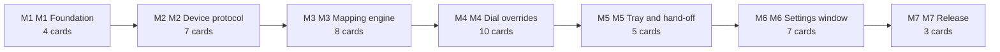

# freewheel milestones

```mermaid
%% freewheel milestones (mermaid)
flowchart LR
    M1["M1 M1 Foundation<br/>4 cards"]
    M2["M2 M2 Device protocol<br/>7 cards"]
    M3["M3 M3 Mapping engine<br/>8 cards"]
    M4["M4 M4 Dial overrides<br/>10 cards"]
    M5["M5 M5 Tray and hand-off<br/>5 cards"]
    M6["M6 M6 Settings window<br/>7 cards"]
    M7["M7 M7 Release<br/>3 cards"]
    M1 --> M2
    M2 --> M3
    M3 --> M4
    M4 --> M5
    M5 --> M6
    M6 --> M7
```
